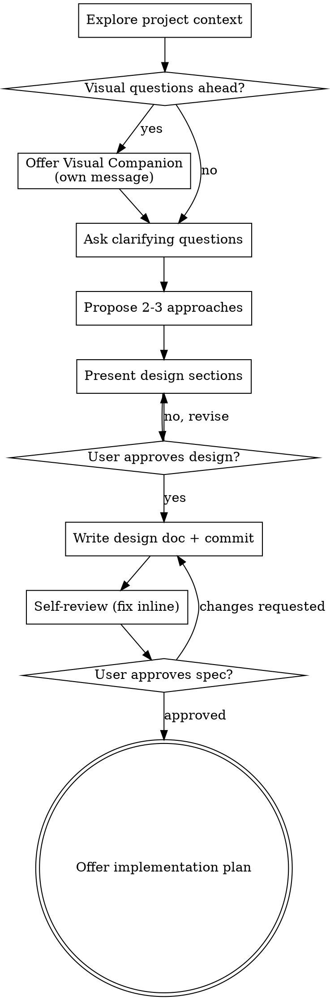

# brainstorm

Turn an idea into a fully formed design through collaborative dialogue. Ends in a dated design doc, committed to `master`. Optional second half writes an implementation plan.

Argument: `$ARGUMENTS` — optional topic hint (free-form). Empty = start by asking what to brainstorm.

## Hard gate

For the duration of this command, do NOT:

- Write or edit files under [`apps/`](../../apps/)
- Edit [`apps/api/prisma/schema.prisma`](../../apps/api/prisma/schema.prisma) or create migrations
- Commit code changes
- Invoke the `Agent` tool with `isolation: "worktree"`

…until the design has been written to its target location AND the operator has approved it. The target location depends on scope (see step 6): module-scoped work distributes into `docs/modules/<slug>/`; cross-cutting work writes a dated spec to `docs/dev/specs/`. This applies to every brainstorm regardless of perceived simplicity — "too simple for a design" is where unexamined assumptions cause the most wasted work.

Writing the design documents themselves (step 6) is permitted and expected.

## Steps

Track these as a TodoWrite list and complete in order:

1. Explore project context
2. Offer Visual Companion (only if upcoming questions will be visual)
3. Ask clarifying questions (one at a time)
4. Propose 2-3 approaches
5. Present design sections (approval after each)
6. Write the design — distribute into [`docs/modules/<slug>/`](../../docs/modules/) for module-scoped work, or write a dated spec at `docs/dev/specs/<YYYY-MM-DD>-<topic>-design.md` for cross-cutting work
7. Self-review every file written (fix inline)
8. User reviews the written design
9. Offer optional implementation plan → `docs/dev/plans/<YYYY-MM-DD>-<topic>.md`

## Process flow



## Step details

### 1. Explore project context

Read in the project's source-of-truth order (from [`CLAUDE.md`](../../CLAUDE.md)):

1. Relevant [`docs/modules/<slug>/`](../../docs/modules/) if the topic is module-scoped — `README.md` (folder index), `rics-module-specs.md` (RICS port lineage), `business-functional.md`, `api.md`, `schema.md`, `tasks.md`, `decisions.md`. Not all files exist for every module — read the ones present.
2. Related dated entries in [`docs/dev/specs/`](../../docs/dev/specs/)
3. [`docs/zacks-retail-manual/<slug>.md`](../../docs/zacks-retail-manual/) if UX-facing
4. [`docs/rics-reference/`](../../docs/rics-reference/) if porting RICS behavior — cite page numbers so the lineage back to the baseline stays intact
5. [`docs/PROJECT_STATUS.md`](../../docs/PROJECT_STATUS.md) for current phase and latest milestone
6. Most recent [`docs/dev/handoffs/`](../../docs/dev/handoffs/) (filename-date sort)
7. Most recent [`docs/dev/milestones/`](../../docs/dev/milestones/)

Skim, don't exhaustively read. The goal is to know what already exists before proposing something.

### 2. Offer Visual Companion (conditional)

If you anticipate upcoming questions will involve visual content (mockups, wireframes, layout comparisons, architecture diagrams), offer the companion once for consent:

> "Some of what we're working on might be easier to explain if I can show it in a web browser — mockups, diagrams, side-by-side comparisons. The companion runtime isn't wired up yet and we'd build a minimal version for this session if you want to try it. Want to? (Text-only is the default.)"

**This offer MUST be its own message.** No clarifying questions, no context summary combined with it. Wait for the response before continuing. If declined (default), proceed in the terminal.

**Per-question decision, even after acceptance:** Use the browser only when the question IS visual — mockups, wireframes, layout comparisons. Stay in the terminal for text-shaped questions (requirements, conceptual choices, tradeoff lists, scope decisions). A question about a UI topic is not automatically a visual question.

### 3. Clarifying questions

One at a time. Prefer multiple choice when it fits; open-ended when it doesn't. Focus on purpose, constraints, and success criteria.

**Minimize clarifying questions.** If the operator has already answered a related question earlier in the conversation, don't re-ask. Prefer proposing and letting the operator redirect.

**Scope check first.** If the work describes multiple independent subsystems, or crosses module boundaries per [`docs/MODULES.md`](../../docs/MODULES.md), flag immediately. Propose decomposing by module before specifying — each sub-project gets its own `/brainstorm` cycle with its own spec and plan.

**Lines of inquiry worth surfacing when they're relevant** (not required output fields — ask about them only if the topic touches):

- Rollout phase target — A (mirror-backed), B (operator UI), or C (Postgres-only) per the Rollout-phases section of [`CLAUDE.md`](../../CLAUDE.md)
- Module(s) affected and any cross-module contracts implied
- Data-source plan — which reads come from `rics_mirror` vs. `public` / `app` / `platform`; where writes land
- Hard-rule surfaces — SKU lookup warmup ([`docs/operations/sku-lookup-index-warmup.md`](../../docs/operations/sku-lookup-index-warmup.md)), OLE DB async helper ([`docs/operations/access-oledb-async-spawn.md`](../../docs/operations/access-oledb-async-spawn.md)), RICS mirror sync ([`docs/operations/rics-mirror-sync.md`](../../docs/operations/rics-mirror-sync.md))
- Currency rendering if UI / reports / exports are in scope — HNL only, no `$` / `USD` / `en-US` formatters

### 4. Propose approaches

2-3 options, trade-offs each, lead with your recommendation and why. Present conversationally — not a numbered design matrix.

### 5. Present design sections

Scale each section to its complexity: a sentence for simple points, up to ~200-300 words for nuanced ones. Ask after each whether it looks right before moving to the next.

Cover — only to the depth the work demands:

- Architecture
- Components
- Data flow
- Error handling
- Testing

**Design for isolation and clarity.** Break the system into smaller units that each have one clear purpose, communicate through well-defined interfaces, and can be understood and tested independently. If you can't answer "what does it do, how do you use it, what does it depend on" for each unit, the boundaries need more work. A file that has grown large is often a signal it's doing too much.

**Working in the existing codebase.** Follow existing patterns. Where existing code has problems that affect this work, include targeted improvements in the design. Don't propose unrelated refactoring — stay focused on what serves the current goal.

### 6. Write the design — placement depends on scope

**First, decide placement.** Ask: does the design touch one module's surface (one entry in [`docs/MODULES.md`](../../docs/MODULES.md)), or does it cut across modules / change project-wide conventions?

- **Module-scoped** → distribute the design across the module's canonical folder structure at [`docs/modules/<slug>/`](../../docs/modules/) (see file roles below). Also keep a dated brainstorm-session record at `docs/dev/specs/<YYYY-MM-DD>-<topic>-design.md` with a banner pointing at the module folder, so chronological queries (`/index-knowledge`, history audits) still find the session. The module folder is the living source of truth; the dated spec is the historical artifact.
- **Cross-cutting** → write a single dated spec at `docs/dev/specs/<YYYY-MM-DD>-<topic>-design.md` only. Examples: rollout-phase changes, schema conventions, ETL architecture, project-wide naming.

#### Module-folder file roles

The convention is set by each module's `README.md`. The standard set (per [`docs/modules/products/README.md`](../../docs/modules/products/README.md)) is:

| File | What goes in it |
|---|---|
| `README.md` | Folder index — file roles + module summary. Update only if you add a new file type. |
| `rics-module-specs.md` | RICS port lineage — what RICS did, what's changing. Append-only for module-scoped brainstorms (most brainstorm output does NOT belong here). |
| `business-functional.md` | Objective, users / roles, main features, workflow, business rules, acceptance criteria. Functional voice, no code. |
| `api.md` | HTTP API contracts — method, path, purpose, request, response, status codes, validation. |
| `schema.md` | Postgres schema — DDL, indexes, constraints, migration references. Per-schema home (`rics_mirror` / `public` / `app` / `platform`). |
| `tasks.md` | Numbered engineering tasks — phase target (A/B/C), size, dependencies, scope deliverables, acceptance checks. |
| `decisions.md` | Module-scoped ADRs — Context / Decision / Consequences / Alternatives considered / Related. Most-recent-first. |
| `tech-description.md` | Forward technical description — anchors in current code. Defer creating this for unbuilt features; write after first implementation lands so it reflects reality. |

**Rule:** every brainstorm decision lands in exactly one of these files. Don't duplicate content across files; cross-link instead. Files that would be empty for a given brainstorm are skipped (no placeholder writes).

Voice across all files: operator-neutral, factual. No "I" / "we decided" — declarative statements.

#### Dated brainstorm-session record (for module-scoped work)

Path: `docs/dev/specs/<YYYY-MM-DD>-<topic>-design.md`. Banner at the top:

```markdown
> **Distributed into [`docs/modules/<slug>/`](../../modules/<slug>/) on <YYYY-MM-DD>.**
> The module folder is the living source of truth; this file is the original brainstorm-session record, kept for chronology and `/index-knowledge` queries.
```

The dated spec then carries the full transcript of decisions + rejected alternatives. Cross-cutting brainstorms skip the banner — the dated spec is the canonical source.

#### Commit

Single commit to `master`. Message convention:

- **Module-scoped:** `docs(<slug>): <topic> — brainstorm output` (e.g. `docs(products): sku-extended-attributes-foundation — brainstorm output`).
- **Cross-cutting:** `docs(spec): <topic> — brainstorm output`.

Trailer:

```
Co-Authored-By: Claude Opus 4.7 (1M context) <noreply@anthropic.com>
```

### 7. Self-review (fix inline)

Look at the written spec with fresh eyes:

- **Placeholder scan** — any "TBD" / "TODO" / vague-requirement lines → resolve or cut.
- **Internal consistency** — do sections contradict? Does the architecture match the feature description?
- **Scope check** — focused enough for one plan, or does it need decomposition?
- **Ambiguity check** — can any requirement be read two ways? Pick one; make it explicit.
- **Project lints:**
  - No `$` / `USD` / `en-US` currency formatter anywhere in the spec
  - No branch / PR / worktree language
  - No [`legacy/`](../../) references (retired folder)
  - Operator-neutral voice throughout

Fix inline. Don't re-review — fix and move on.

### 8. User reviews the written spec

Message the operator:

> "Spec written and committed to `<path>`. Review it and let me know if you want changes before we move on to the implementation plan."

Wait for response. If changes are requested, apply them and re-run the self-review checklist. Proceed only once approved.

### 9. Optional implementation plan

Ask:

> "Write an implementation plan to `docs/dev/plans/<YYYY-MM-DD>-<topic>.md` now, or defer?"

- **Now** → write a dated plan with numbered build steps, commit with `docs(plan): <topic>`, then stop.
- **Defer** → stop. The operator can run `/brainstorm` again later for the plan slice, or write it manually.

## Rules the command enforces

- **`master` only.** No branches, no worktrees, no force operations.
- **Never auto-edit [`CLAUDE.md`](../../CLAUDE.md).** If the brainstorm produces something that belongs in project instructions, write it to `docs/dev/specs/` as a decision and let the operator promote.
- **Never write to `legacy/`.** That folder is retired.
- **HNL-only currency** in generated content. No `$` / `USD` / `en-US` formatters.
- **Operator-neutral voice** — factual, declarative. No "I" / "we decided."
- **One question per message** during the clarifying phase.
- **Scope check before detail** — flag multi-subsystem or multi-module work and propose decomposition first.

## Key principles

- **YAGNI ruthlessly** — cut unnecessary features from every design.
- **Explore alternatives** — always 2-3 approaches before settling.
- **Incremental validation** — approval gate after each design section, after the written spec, and before the plan.
- **Be flexible** — go back and clarify when something doesn't make sense.

## Example invocations

- `/brainstorm` — open-ended; command asks what to brainstorm.
- `/brainstorm add season-based discount rule to pricing module` — topic hint up front.
- `/brainstorm buyer-mode navigation for the manual` — doc/UX scope.
- `/brainstorm flip inventory adapter from OLEDB to rics_mirror` — module-cutover scope.
