# ER Diagram - Shoe Store Inventory (Migrations 010-019)

## Scope

This document reflects the canonical inventory schema, the RICS import staging flow introduced in `010_rics_import_integrity`, the womens-category guardrail model added in `011_womens_category_guardrails_and_perf`, OTB policy audit logging from `012_otb_policy_audit_log`, server-side index hardening from `013_server_side_table_index_coverage`, sales-ledger/OTB SKU line support from `014_sales_ledger_otb_lines`, month/department/SKU-size OTB financial planning from `015_otb_monthly_department_sku_planning`, transaction-ledger integrity hardening from `016_transaction_ledger_integrity_hardening`, the inventory balance baseline from `017_inventory_balance_baseline`, PO discrepancy metadata from `018_po_receipt_discrepancy_metadata`, and canonical movement-ledger normalization from `019_inventory_movement_ledger_normalization`.

## Migration 014-017 Verification Harness

Run the reversible migration verification harness with:

```bash
pnpm --filter @benlow-rics/api run db:verify:migration014
pnpm --filter @benlow-rics/api run db:verify:migration015
pnpm --filter @benlow-rics/api run db:verify:migration016
pnpm --filter @benlow-rics/api run db:verify:migration017
pnpm --filter @benlow-rics/api run db:verify:migration019
```

Expected behavior:
- exits `0` and prints `PASS` after each harness applies its migration UP SQL, runs section A checks from the paired `.verify.sql`, applies DOWN SQL, and runs section B checks.
- exits non-zero and prints `FAIL` if any required object existence/cleanup assertion fails.

## Entity Relationship Diagram

```mermaid
erDiagram
  vendors ||--o{ skus : supplies
  ref_categories ||--o{ skus : classifies
  ref_brands ||--o{ skus : brands
  ref_colors ||--o{ skus : colors
  skus ||--o{ sku_sizes : has
  skus ||--o{ inventory : stocked_as
  sku_sizes ||--o{ inventory : optional_size
  skus ||--o{ inventory_balances : balanced_as
  sku_sizes ||--o{ inventory_balances : balanced_size
  skus ||--o{ sales_transactions : sold_as
  skus ||--o{ purchase_order_lines : ordered_as
  purchase_orders ||--o{ purchase_order_lines : contains
  purchase_orders ||--o{ po_status_history : tracks
  otb_budgets ||--o{ otb_budget_audit : audited_by
  otb_budgets ||--o{ otb_commitments : commits
  otb_budgets ||--o{ otb_sku_plan_lines : allocates
  otb_budgets ||--o{ otb_monthly_department_sku_plan : plans_financials_for
  purchase_orders ||--o{ otb_commitments : commits_against
  purchase_orders ||--o{ otb_policy_audit_log : policy_evaluated_for
  ref_departments ||--o{ otb_policy_audit_log : policy_scoped_to
  skus ||--o{ otb_sku_plan_lines : planned_as
  skus ||--o{ otb_monthly_department_sku_plan : planned_financially_as
  sku_sizes ||--o{ otb_monthly_department_sku_plan : planned_size_as

  rics_import_batches ||--o{ rics_import_files : contains
  rics_import_files ||--o{ rics_import_rows : parses_to
  rics_import_rows ||--o| rics_import_quarantine : quarantines
  rics_import_batches ||--o{ rics_import_apply_log : emits
  rics_import_rows ||--o{ rics_import_apply_log : applied_as
  skus ||--o{ rics_import_rows : mapped_target
  sku_sizes ||--o{ rics_import_rows : mapped_target_size

  ref_departments ||--o{ ref_categories : controls_macro
  ref_categories ||--o{ womens_shoe_categories : women_subset
  womens_shoe_categories ||--o{ skus : guards_category
  ref_departments ||--o{ skus : controls_macro
  ref_brands ||--o{ style_colors : styles
  ref_colors ||--o{ style_colors : colors
  ref_categories ||--o{ style_colors : categorizes
  style_colors ||--|| sku_style_colors : maps_to
  skus ||--|| sku_style_colors : maps_to
  ref_heel_types ||--o{ style_colors : heel_type
  ref_heel_material_types ||--o{ style_colors : heel_material

  inventory_locations ||--o{ po_receipts : receives_at
  inventory_locations ||--o{ transfer_orders : from_to
  inventory_locations ||--o{ inventory_adjustments : from_location
  inventory_locations ||--o{ inventory_adjustments : to_location
  purchase_orders ||--o{ po_receipts : receives
  po_receipts ||--o{ po_receipt_lines : contains
  purchase_order_lines ||--o{ po_receipt_lines : receives_from
  transfer_orders ||--o{ transfer_order_lines : contains
  inventory_adjustments ||--o{ inventory_adjustment_lines : contains
  skus ||--o{ po_receipt_lines : received_as
  skus ||--o{ transfer_order_lines : transferred_as
  skus ||--o{ inventory_adjustment_lines : adjusted_as
  sku_sizes ||--o{ po_receipt_lines : received_size
  sku_sizes ||--o{ transfer_order_lines : transferred_size
  skus ||--o{ inventory_movement_ledger : movement_sku
  inventory_locations ||--o{ inventory_movement_ledger : movement_location
  sales_transactions ||--o| inventory_movement_ledger : source_sale
  po_receipt_lines ||--o| inventory_movement_ledger : source_receipt_line
  transfer_order_lines ||--o{ inventory_movement_ledger : source_transfer_line
  inventory_adjustment_lines ||--o| inventory_movement_ledger : source_adjustment_line
```



## Table-Level Comments

- `vendors`: Master vendor registry with purchasing terms.
- `ref_categories`: Canonical category dictionary mapped to macro departments (not globally restricted to womens codes).
- `womens_shoe_categories`: Guardrail subset sourced from `ref_categories` to enforce womens-only SKU category writes.
- `skus`: Canonical SKU header. Natural key identity is `brand + style + color`.
- `sku_sizes`: Size rows per SKU. Combined with SKU natural key, this yields `brand + style + color + size` uniqueness.
- `inventory`: On-hand and reserved stock by SKU/size.
- `inventory_balances`: Denormalized SKU-size balance snapshot with category/macro/brand/style/color/size keys and optimistic-concurrency `version`.
- `purchase_orders`: PO headers for procurement lifecycle.
- `purchase_order_lines`: Ordered units and received quantities per SKU. Guard trigger prevents `quantity_received > quantity_ordered`.
- `sales_transactions`: Unit sales facts.
- `otb_budgets`: Open-to-Buy plan by department and month.

Import staging:

- `rics_import_batches`: Import execution unit for one RICS load.
- `rics_import_files`: Uploaded files under a batch with parse/validation counts.
- `rics_import_rows`: Row-level normalized payload and validation state.
- `rics_import_quarantine`: Manual review queue for invalid rows.
- `rics_import_apply_log`: Immutable apply ledger for inserts/updates/skips/errors.
- `schema_table_comments`: SQLite-compatible metadata store for table comments.

Canonical hardening and operations:

- `ref_departments`: Canonical macro-department catalog shared across categories, SKUs, and OTB planning.
- `ref_heel_types`: Heel type dictionary (`STILETTO`, `CHUNKY`) used for SKU validation.
- `ref_heel_material_types`: Heel material dictionary (`LINED`, `PLASTIC`) used for SKU validation.
- `style_colors`: Explicit `StyleColor` entity with natural key `brand + style + color`.
- `sku_style_colors`: One-to-one bridge linking each canonical SKU to one `StyleColor`.
- `inventory_locations`: Store/warehouse master for receipts, transfers, and adjustments.
- `po_receipts`: PO receiving headers by location.
- `po_receipt_lines`: Received quantities by SKU/SKU size. Triggers enforce receipt-header/PO-line alignment and SKU-size ownership.
- `transfer_orders`: Inter-location transfer headers.
- `transfer_order_lines`: Transfer quantities by SKU/SKU size. Trigger enforces SKU-size ownership.
- `inventory_adjustments`: Adjustment headers (`RECEIPT`, `TRANSFER`, `MANUAL_ADJUST`, `RETURN`, `DAMAGE`, `SHRINKAGE`) with from/to location semantics.
- `inventory_adjustment_lines`: Per-SKU line items for each adjustment header. Trigger enforces non-zero signed quantities.
- `inventory_movement_ledger`: Canonical signed inventory movement ledger at SKU+location grain. Each row links to exactly one source path (`sales_transactions`, `po_receipt_lines`, `transfer_order_lines`, or `inventory_adjustment_lines`) and enforces movement-type sign conventions.
- `otb_commitments`: Committed and received OTB amounts by PO and budget period.
- `otb_sku_plan_lines`: SKU-level OTB unit allocations by budget period.
- `otb_monthly_department_sku_plan`: OTB financial plan lines at month+department+SKU-size grain with budget, committed, and received amounts.
- `otb_policy_audit_log`: Immutable audit ledger of OTB policy decisions (`allow`, `warn`, `hard_stop`, `override`, `exception`) with thresholds, approvals, and trace metadata.
- `v_otb_budget_vs_actual`: Read-model view for budget vs committed vs received.
- `v_otb_sku_lines`: Read-model view combining budget units, sold units, and on-order units per SKU/period.
- `v_otb_monthly_department_sku_plan`: Read-model view exposing month key (`YYYY-MM`) and derivable variance fields per department+SKU-size line.
- `v_sku_category_guardrail_violations`: Diagnostic view listing SKUs with category assignments outside the womens guardrail subset.
- `v_inventory_movement_reconciliation`: Read-model view aggregating expected stock delta by SKU+location directly from canonical movement rows.

## Natural Key Enforcement Strategy

- Unique index `ux_skus_brand_style_color` enforces one canonical SKU row per `brand + style + color`.
- Existing unique constraint on `sku_sizes (sku_id, size_label)` enforces one size row per SKU.
- Together they enforce the full identity tuple `brand + style + color + size`.
- Triggers prevent new or updated SKU writes without `brand_id`, `color_id`, and non-blank `style`, and prevent blank `size_label` values.

## Notes

- `StyleColor` is represented as a logical entity (`brand + style + color`) and enforced physically via index/constraints on `skus`.
- `StyleColor` is also represented explicitly in `style_colors` for integration-friendly joins and API payload alignment.
- Macro departments are restricted to: `FORMAL`, `CASUAL`, `FIESTA`, `SANDALIAS`, `BOOTS`, `COMFORT`.
- Womens SKU category policy is enforced via `womens_shoe_categories` + SKU write-time triggers; `ref_categories` remains a full master catalog and is not globally restricted to `556-599`.
- Heel validation is constrained to canonical values via catalog-backed triggers (`Stiletto`/`Chunky` and `Lined`/`Plastic`).
- Migration `016_transaction_ledger_integrity_hardening` adds DB-level trigger guards for transaction consistency across receipt, transfer, and adjustment write paths, plus composite indexes for transaction list/read-model query patterns.
- Migration `017_inventory_balance_baseline` adds the CTO baseline filter indexes `(category, macro_department, brand, style, color, size)` and `(category, macro_department, updated_at, id)` plus DB-level `version` guardrails for optimistic concurrency.
- Migration `019_inventory_movement_ledger_normalization` introduces the canonical movement ledger with one-source-path constraints, source alignment triggers, signed-quantity enforcement per movement type, source-table ingestion triggers, and reconciliation view support.

